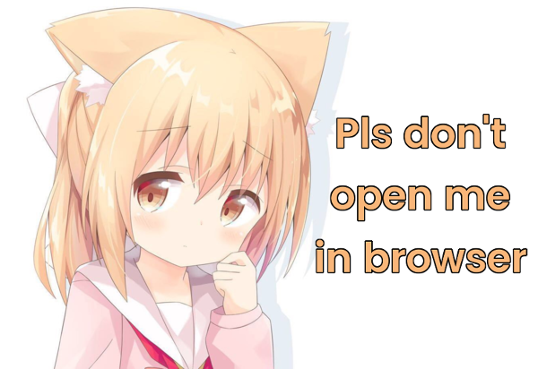
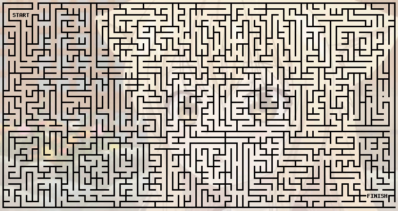
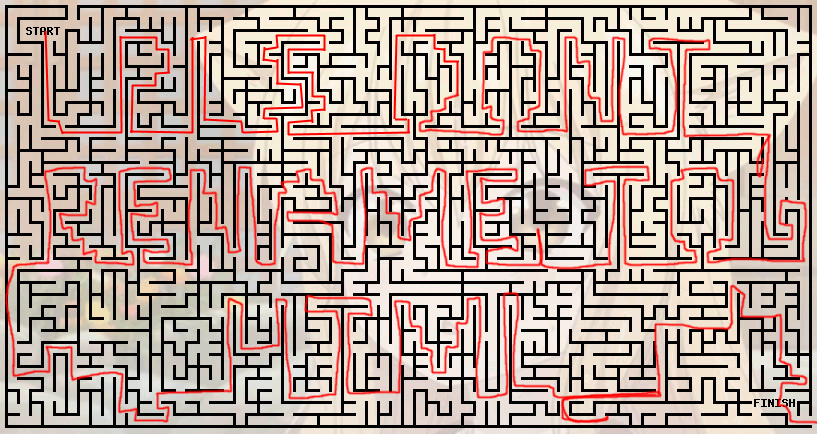
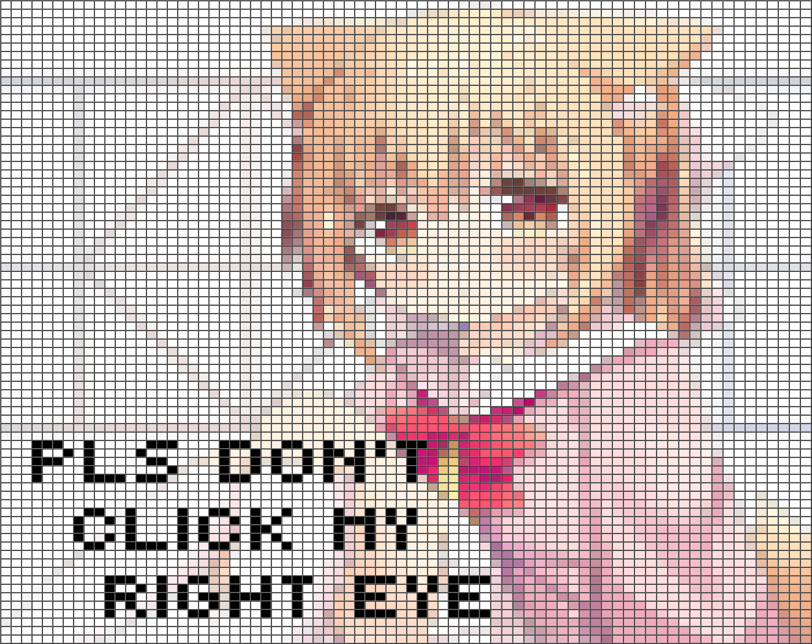
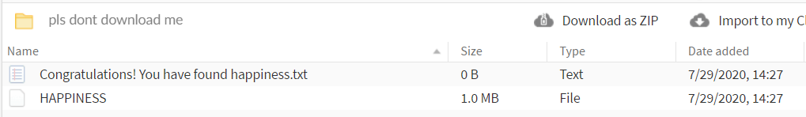

# Anime girl "pls don't open me in a browser" puzzle
Breaking down another discord meme

### Source link
https://cdn.discordapp.com/attachments/498493897807364098/738481027437035650/pls_dont.png
\
#### Step 1 - Opening the link on a browser
This image is an apng with 2 frames, showing another one once open on a browser. The girl tells us to download the file and open it up on a text editor.

#### Step 2 - Opening it with text editor
I don't know how the author added arbitrary text to the end of the file.\
From the lines 3352 to 3370, there's this kitten:
```
pls don't rename me to .rar
           |`-.._____..-'|
           :  > .  ,  <  :
           `./ __`' __ \,'
            | (|_) (|_) |
            ; _  .  __  :
            `.,' - `-. ,'
              `, `_  .'
              /       \
             /         :
            :          |_
           ,|  .    .  | \
          : :   \   |  |  :
          |  \   :`-;  ;  |
          :   :  | /  /   ;
           :-.'  ;'  / _,'`------.
           `'`''-`'''-'-''--.---  )
                        nya `----'
```
#### Step 3 - Renaming the .png to .rar
Important note here: it doesn't open with 7zip for some reason. It must be opened with the actual Winrar. I don't know exactly how the author of this meme managed to introduce some archive within this APNG.\
Inside there's an audio file:\
`pls_dont_play_in_vlc.mp3`

#### Step 4 - Opening the file in VLC
The audio plays a girl saying:
```
"Oni-chan please don't read the metadata"
```

#### Step 5 - Reading the metadata
I used MediaInfo, and got the following:
```
Comment                     : pls dont turn monochrome at ezgif.com / pls dont turn monochrome at ezgif.com
Software                    : pls dont turn monochrome at ezgif.com
```

#### Step 6 - Uploading the audio file to ezgif.com
Uploading the audio to https://ezgif.com/effects and applying the effect, the following image is generated:
\
(Opening this file with MPC also shows the QR code with color)

#### Step 7 - Scanning the QR code
The QR code redirects to this [URL](https://ibb.co/JknS55W) with a maze to solve.\
\
The image is a ".gif" file.

#### Step 8 - Solving the maze
Thanks to riktoi, we can see "pls don't rename to HTML".\


#### Step 9 - Renaming the ".gif" to ".html"
Doing so and opening with a browser, generates a web-page with a lot of ascii garbage, first few lines telling us not to scroll down:
```
þð____________________PLS DONT SCROLL DOWN____________________PLS DONT SCROLL DOWN____________________PLS DONT SCROLL DOWN____________________PLS DONT SCROLL DOWN____________________PLS DONT SCROLL DOWN____________________PLS DONT SCROLL
````
Scrolling down, we see the following picture made out of squares:\


#### Step 10 - Clicking on her right eye
If you click on the wrong eye you get redirected to [this monky](https://www.youtube.com/watch?v=FveF-we6lcE) a popup says "that's my left eye retard".\
If you click on the correct eye, you get redirected [here](https://www.youtube.com/watch?v=TwKn5dymtd0).

#### Step 11 - Reading the video
The youtube channel called ["pls stop procastinating"](https://www.youtube.com/channel/UCZ5CgPM5socA8Xyac2QUOVw/featured) has a single video we've accessed from the previous step.
By tilting your phone the image on the video says:\
"pls dont read every first letter in description".

#### Step 12 - Reading the first letter of the entire description
```python
desc = """pls like, subscribe, drink one nettle tea choco hazel epic cream kahlúa, hit the mother licking bell okay; then take one 
minute, release inner gorilla harambe transcendent calm; once ready - newly experience reality."""
result = ""
for word in desc.split(" "):
	result += word[0]
print(result)
```
"plsdontcheckhtmlbotto
rightcor-ner"

#### Step 13 - Checking the bottom right corner of the HTML
Clicking there opens a [mega.nz folder](https://mega.nz/folder/8UIwwKBa#t1Cm4FlxKIb1TgQ4UgXJrQ).\
\
Extracing the archive, we get this "HAPPINESS" file with no particular file extention. Inside the file there's no clue. Opening with MPC or MediaInfo gives us nothing. The puzzle seems to be finally over, BUT...

#### Step 14 - Reading the youtube comments from the previous video
The user "Nohorse" points out that you can import HAPPINESS into Audacity as "Raw Data", playing it generates a harsh crunching sound. By trial and error, "unsigned 8-bit PCM, stereo" is apparently the correct way of doing so, and it generates a crispy sound of Korone eating chips:\
`HAPPINESS.ogg`\
Apparently this is the source:\
https://www.youtube.com/watch?v=YXxBm1UdD_k\

FIM
